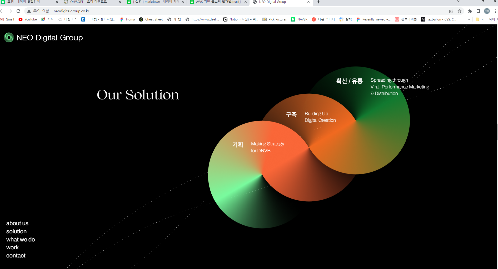

# 프로젝트명-회사 프로젝트제작(팀작업)

## 팀원
<!-- FE(프론트엔드), BE(백엔드) -->
FE/BE | 이름 | Github | 작업사항
:---|:---|:---|:---
FE|이초롱|[@ABCD](http://github.com/abcd)|[회사소개](http://~),
[회원가입](http://~),[회원가입](http://~)
FE|이초롱|

## 프로젝트 사이트
[프로젝트 바로가기](http://github.com)

## 프로젝트 사이트
[프로젝트 바로가기](httpL//giyhub.com)

작업|주소
---|---
FE |작업 : http://github.com 
FE |작업 : http://github.com 

## 프로젝트 기획서
[프로젝트 기획서 pdf](http://github.com)

## 프로젝트 영상

# 프로젝트 기능 구현
## 프로젝트 기능 리스트
- [x] 1. 메뉴구현
- [x] 2. 비주얼 배너 구현
- [x] 3. 메뉴구현 (작업중)
- [x] 4. 메뉴구현 

### 1. 메뉴구현
- [x] 리뉴얼 디자인, html/css / vanilla js

#### 기획서에 들어가는 내용 작성

### 전

### 후

